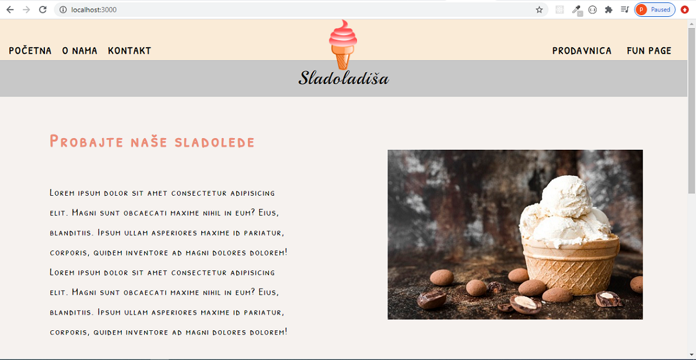
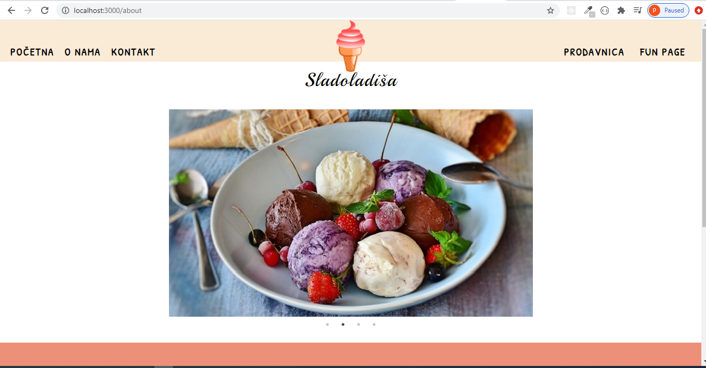
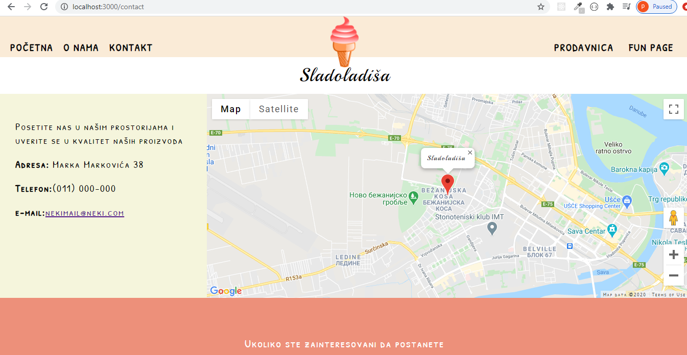
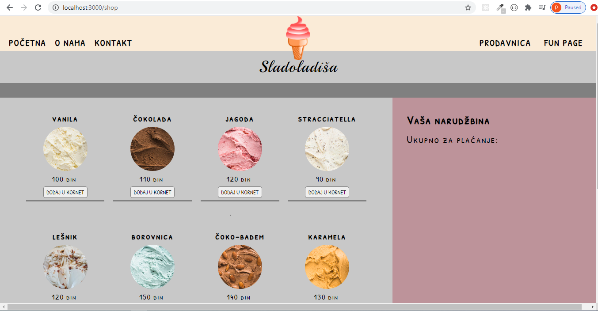
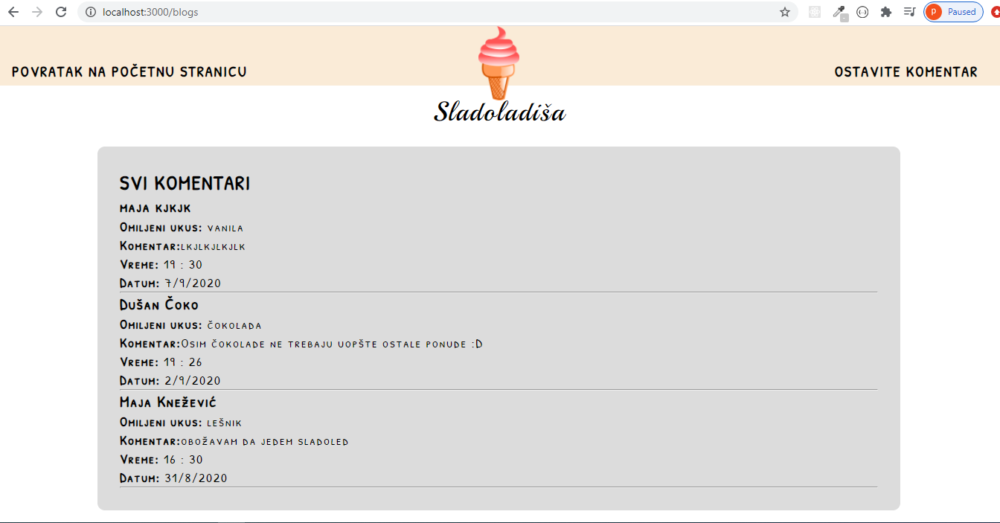

## Test project Sladoladisa

Project is depiction of web based ice cream shop. The project sublimes shop description, 

location and product information, online shop and fun page with optional comments, 

which are stored in database.

**Used technologies:**
- HTML5/CSS3
- JavaScript
- jQuery(Tooltipster, Slick)
- Node.js
- MongoDB
- templating engine EJS

**short app overview** 

|  | 
|:--:| 
| *Home Page* |

|  | 
|:--:| 
| *About Page* |

| | 
|:--:| 
| *Contact Page* |

| | 
|:--:| 
| *Shop Page* |

| | 
|:--:| 
| *Fun Page* |

